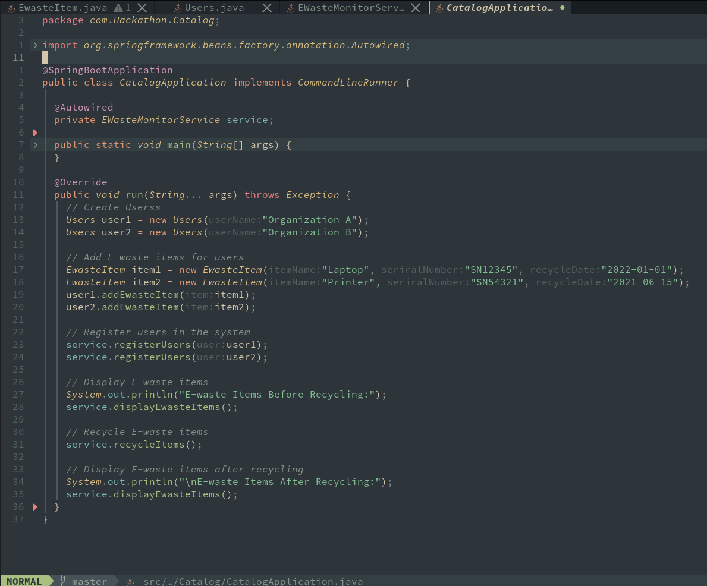
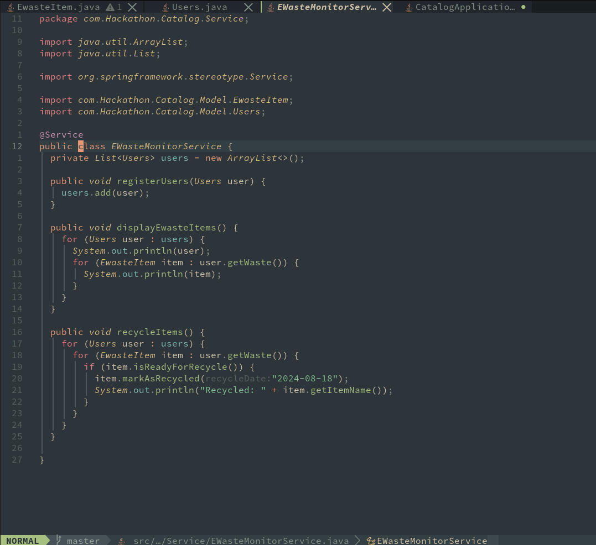
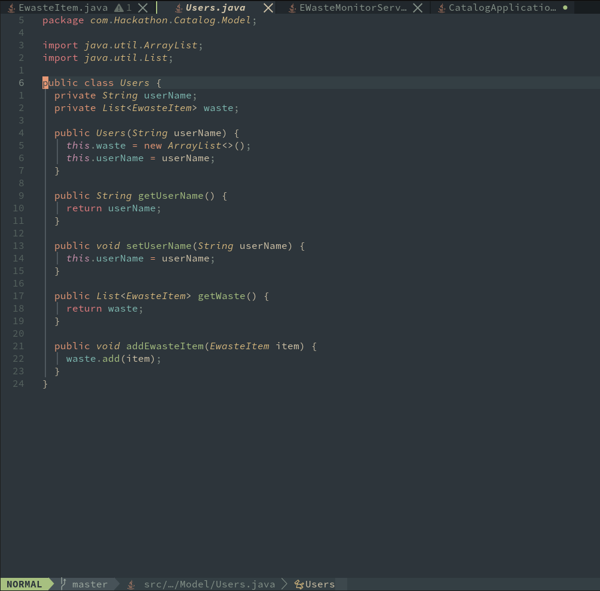
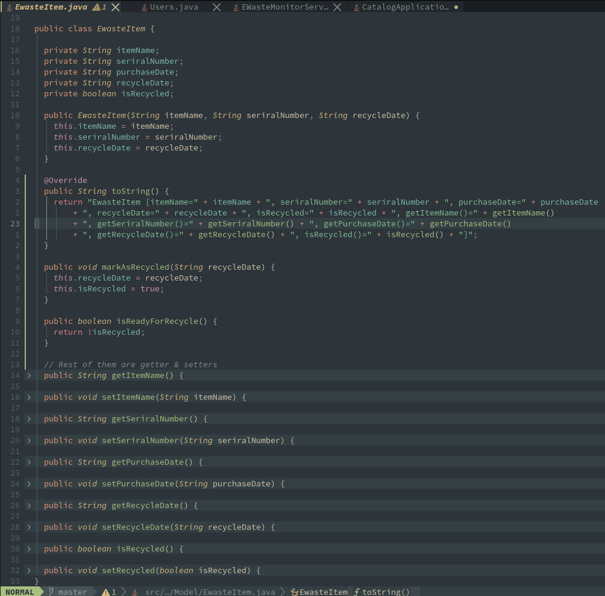
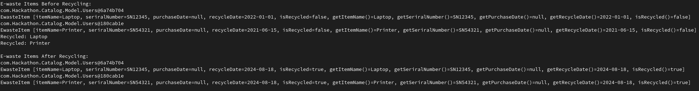

# Hackathon

Plz find the master branch for the source codes

# E-waste Monitoring System

## Project Overview

The **E-waste Monitoring System** is a console-based Java application built using Spring Boot. This system allows organizations to monitor and recycle electronic waste (E-waste).

## Screenshots

### Main Class with sample data insertion - Initial State

### E-waste Monitoring Service 

### User Class

### EWasteItem Class

### Final Output

## Features

- **Track E-waste Items**: Monitor and manage electronic items such as laptops, printers, etc.
- **Recycle Management**: Automatically identify and mark items ready for recycling.

